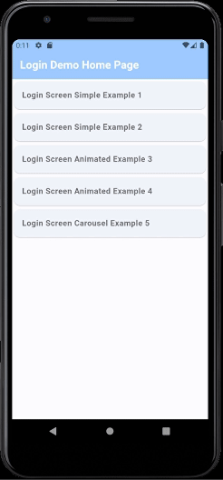

# Flutter - Simple and Elegant Login Screens Designed For Mobile Apps

This project is a compilation of 5 simple and elegantly designed login screens created with Flutter.
In each "login_screenX.dart" file, you will find everything related to the screen, except for "gradient_button.dart" and "util.dart" (which contains the title displayed on each screen).

## Screens Included
#### Mobile View Example

- #### Login Screen Simple Example 1

- #### Login Screen Simple Example 2

- #### Login Screen Animated Example 3

- #### Login Screen Animated Example 4

- #### Login Screen Carousel Example 5

## How to contribute
Feel free to use, modify, and contribute to this collection.
